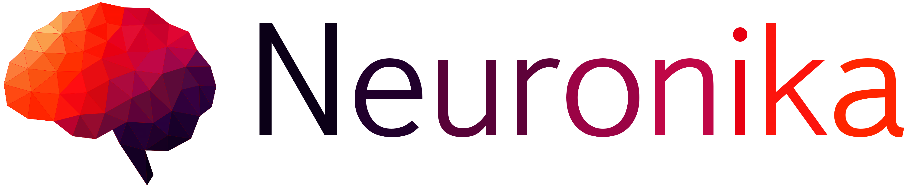

<p align="center">
  
</p>

<hr/>

<p align="center">
  <a href="https://app.circleci.com/pipelines/github/neuronika">
    
  </a>

  <a href="https://codecov.io/gh/neuronika/neuronika">
    
  </a>

  <a href="https://opensource.org/licenses/MIT">
    
  </a>

  <a href="https://docs.rs/neuronika">
    
  </a>
</p>

Neuronika is a machine learning framework written in pure Rust, built with a focus on ease of
use, fast prototyping and performance.

## Add neuronika to your project

```toml
[dependencies]

neuronika = { git = "https://github.com/neuronika/neuronika" }
```

## Dynamic neural networks and auto-differentiation

At the core of Neuronika lies a mechanism called reverse-mode automatic differentiation, that allows you
to define dynamically changing neural networks with very low effort and no overhead by using a lean, fully imperative and define by run API.


## The power of Rust

The Rust language allows for an intuitive, light and easy to use interface while achieving incredible performance.
There's no need for a FFI, everything happens in front of your eyes.

## Crate Feature Flags

The following crate feature flags are available. They configure the [`ndarray`](https://github.com/rust-ndarray/ndarray) backend.

* `serialize` 
  * Enables serialization support for [`serde`](https://github.com/serde-rs/serde) 1.x.

* `blas`
  * Enables transparent BLAS support for matrix multiplication. Uses `blas-src` for pluggable backend, which needs to be configured separately. See [`here`](https://github.com/rust-ndarray/ndarray#how-to-enable-blas-integration) for more informations.

* `matrixmultiply-threading`
  * Enables the `threading` feature in the [`matrixmultiply`](https://github.com/bluss/matrixmultiply) package.

## Contributing

We appreciate and welcome all contributions. If you are planning to contribute back bug-fixes, please do so without any further discussion.

If you plan to contribute new features, utility functions, or extensions to the framework, please first open a discussion and discuss the feature with us. Sending a PR without discussion might end up resulting in a rejected PR because we might be taking the project in a different direction than you might be aware of.

To learn more about making a contribution to Neuronika, please see our [contribution page](CONTRIBUTING.md).

## Getting Help

First, see if the answer to your question can be found in the [API documentation](https://docs.rs/neuronika). If the answer
is not there, please ask for help by opening a [discussion](https://github.com/neuronika/neuronika/discussions) with the question. We'll be glad to help you.


## Project Status

Neuronika is very young and rapidly evolving, we are continuously developing the project and breaking changes are expected during transitions from version to version. We adopt the newest stable Rust's features if we need them.

## License

Dual-licensed to be compatible with the Rust project.

Licensed under the [Apache License, Version 2.0](http://www.apache.org/licenses/LICENSE-2.0) or the [MIT license](http://opensource.org/licenses/MIT), at your option. This file may not be copied, modified, or distributed except according to those terms.